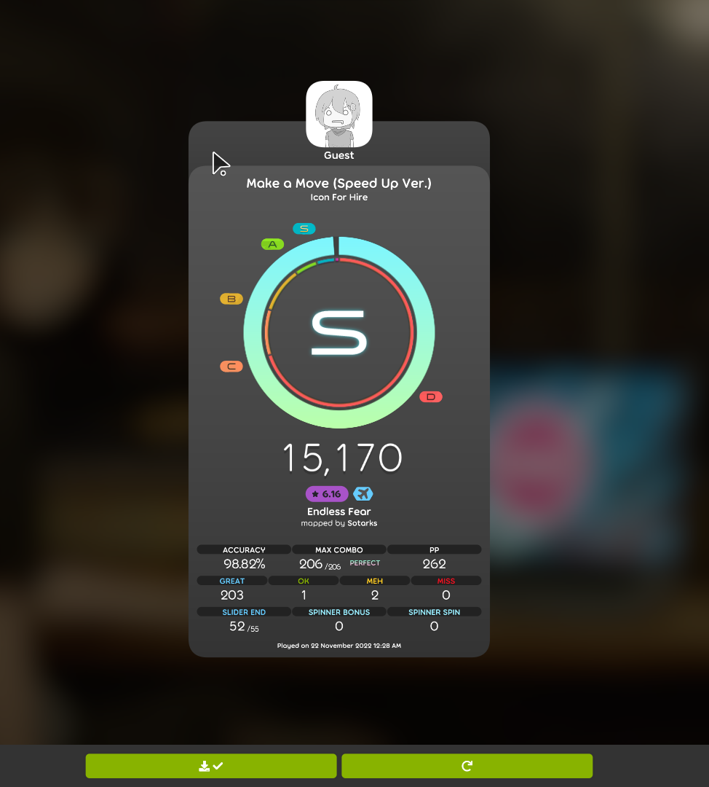

# Osu Neural Network Created Using Pytorch

- DISCLAIMER : I am not responsible for any consequences that stem from the illicit use of the contents of this repository.

## Info

- Data extracted from replays produced by a slightly modified version of [danser-go](https://github.com/Wieku/danser-go)

- Aiming works but clicking does not.

- All skins used are located in [assets/skins](assets/skins)

- Showcase videos [Clicking (DOES NOT WORK CURRENTLY)](https://www.youtube.com/watch?v=ZgHyN98iR1M&t=5s) and [Aiming](https://www.youtube.com/watch?v=YEoSrtow8Qw).

## Quick Start
- The following assume that your monitor/screen size is 1920x1080 (plan to make it dynamic later)
- Clone this repository along with [this](https://github.com/TareHimself/danser-go) modified version of danser
- Build danser using the instructions in the repository
- Copy [danser-settings.json](assets/danser-settings.json) to `"cloned danser repo"/settings/danser-settings.json`
- Launch danser using the built binary
- Once danser is done importing in the config dropdown switch it to the settings we copied earlier
- Switch mode to "Watch a Replay" and select the replay you want to train on
- Switch the dropdown on the bottom from "Watch" to "Record"
- Before recording you can configure the settings to use a different skin.
- Once ready click "danse!" and wait for danser to generate the recording.
- Once done it will open a folder with a json file and an mkv file, these are needed to generate the dataset.
- Going back to the osu-ai folder first setup [Anaconda](https://www.anaconda.com/download)
- Run the following in the terminal to create an enviroment
```bash
conda create --name osu-ai python=3.9.12
conda activate osu-ai
```
- Install [Poetry](https://python-poetry.org/)
- Run the following in the enviroment we created

```bash
poetry install
# For cuda support run "poe force-cuda"
```
- now we can run main
```bash
python main.py
```
- You should see this menu
```bash
What would you like to do ?
    [0] Train or finetune a model
    [1] Convert a video and json into a dataset
    [2] Test a model
    [3] Quit
```
- Select "1" for Convert, name it whatever you want. For the video and json type in the path to the respective files we generated earlier i.e. `a/b/c.mkv` `a/b/c.json`.
- For the number of threads I usually use 5 and we will leave the offset at 0.
- For `Max images to keep in memory when writing` I usually leave it at 0 unless the video is really long
- Now wait for the dataset to be generated
- Now we can train. Select "0" to train then "0" for aim. Name it whatever and select the dataset we just made. I usually set max epochs to a very large number since `ctrl+c` will stop training early.
- And that's it.

## Example Autopilot play below on [this map](https://osu.ppy.sh/beatmapsets/765778#osu/1627148). The model was trained using [this map](https://osu.ppy.sh/beatmapsets/1721048#osu/3560542).



## Example Relax play below on [this map](https://osu.ppy.sh/beatmapsets/1357624#osu/2809623). The model was trained using [this map](https://osu.ppy.sh/beatmapsets/1511778#osu/3287118).


